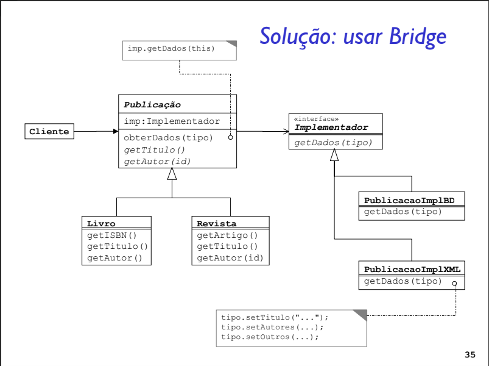

# Prática de Implementação do Padrão Bridge

Para praticar o padrão de projeto Bridge foi proposto a implementação do seguinte projeto:



Para gerar o executável rode o comando no terminal

```bash
    g++ -std=c++20 main.cpp -o main.exe
```

E para executar basta rodar:

```bash
    ./main.exe
```
